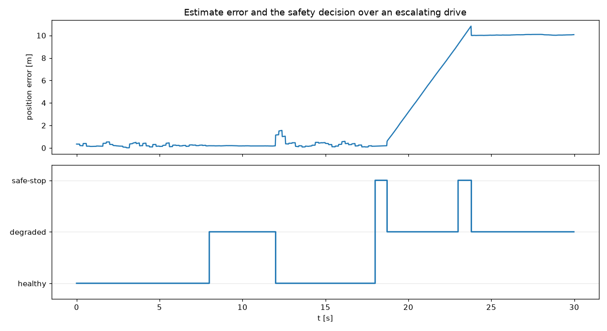
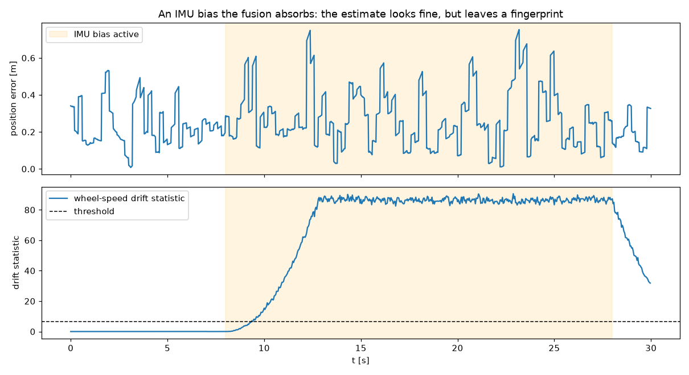

# AV Sensor-Integrity Monitor (simulation)

[](LICENSE)


An open, **simulation-only** study of a hard problem in autonomy: **how a system knows when it can't trust its own sensors, and fails safe instead of failing.**

An automated vehicle fuses several noisy sensors into one estimate of its own state and then acts on that estimate. When a sensor degrades or lies (a GPS fix that jumps, an IMU that drifts, a wheel that slips), two questions decide whether the system is safe: does it notice, and does it degrade safely? This project builds an answer, one honest increment at a time, and puts the reasoning in the open.

It is built and narrated in public at **[knackmentor.com](https://knackmentor.com)** by Andrew Michelis (systems integration & technical delivery).

> **Build logs** live on the [KnackMentor blog](https://knackmentor.com/blog/), one write-up per milestone.


## Honest boundary

This is a **simulation**. It proves the reasoning, the architecture, and the method, not real-world performance. Faults are **injected**, so ground truth is always known and evaluation is non-circular. Where the model's fidelity ends is stated, not hidden. A physical proof-of-concept is a possible later step, not a claim made here.

## What's here (M0–M5)

The project runs as a complete five-step arc, each step a real increment with its own acceptance test and honest numbers measured against known ground truth.

**M0 — the sensor-fusion foundation.** A vehicle simulation, three sensors (GPS / IMU / wheel-speed), and an Extended Kalman Filter that fuses them. On a clean drive the fused estimate tracks truth to within about **0.3 m** in position, **0.03 rad** in heading, and **0.09 m/s** in speed.


**M1 — the first integrity check.** Each measurement is scored by how surprising it is given the uncertainty we expect (the normalized innovation squared, a standard consistency test); a reading that scores too far out is flagged and gated out of the fusion. On an injected **8 m GPS jump** the monitor detects it at the first bad reading with **zero false alarms** afterward, and gating holds position error at **0.42 m** where the ungated estimate follows the spoof out to **5.59 m**.

**M2 — a fault taxonomy, and degrading safely instead of dying.** Detection alone is not enough; the system must decide *which* sensor is at fault (isolation) and *what to do* about it (a safe-state). A safety supervisor turns the raw checks into a policy: one correcting sensor distrusted → gate it, run **DEGRADED**, keep driving; every correcting sensor distrusted at once → **SAFE_STOP**, because there is no longer a trustworthy fix. The surprising honest result: the fusion **shrugs off a biased IMU** as long as the measurements stay good, so a modest IMU bias never trips the instantaneous check. That sets up the next step. (`src/av_integrity/integrity/detector.py`, the `SafetyMonitor`; the catalogue is in [`docs/REFERENCE_fault-taxonomy.md`](docs/REFERENCE_fault-taxonomy.md).)



**M3 — a dynamics twin that catches what the instant check misses.** A slow drift is barely surprising from one reading to the next, so it slips under the instantaneous test. The drift monitor watches the *accumulated* gap instead: unbiased innovations average to zero, but a persistent drift pushes the running average off zero long enough to see (a windowed innovation-mean consistency test, in the spirit of CUSUM change-detection). It catches the absorbed IMU bias from M2 within seconds, where the instant check never does. (`DriftMonitor` in the same module.)



**M4 — robustness: turning anecdotes into rates.** A single run is a story, not a measurement. A Monte-Carlo harness runs many randomized drives and reports the three numbers that actually characterize a detector: **detection rate**, **false-alarm rate**, and **time-to-detect**. GPS-jump detection climbs to **1.0** above a few metres while time-to-detect collapses to about **one sample**; the absorbed-IMU-bias detection has a sharp floor near **1 m/s²** (below the noise floor, small biases are correctly *not* flagged, which is what keeps the rates honest).


**M5 — a public harness, and a clean seam for a private core.** M5 adds no new detection idea. It makes every quoted number **reproducible from a clean checkout** and draws the **open/closed boundary** as one real, testable line of code. `python -m av_integrity report` recomputes every figure quoted here on the spot; `python -m av_integrity figures` rebuilds each PNG from the same runs. Nothing is a stored result that could drift from the code that produced it.

## How it's built

```
src/av_integrity/
  sim/          kinematic vehicle model + ground-truth trajectory
  sensors/      GPS / IMU / wheel-speed, each with fault-injection hooks
  estimation/   the EKF (state = [x, y, heading, speed]) + state definition
  integrity/    the detection interface + reference monitors (passthrough, innovation check,
                the SafetyMonitor safe-state policy, the DriftMonitor) + the open/closed loader
  harness/      scenario runner, accuracy/detection metrics, the Monte-Carlo evaluation + report
  view/         matplotlib plots (estimate vs truth, the detection views)
  __main__.py   `python -m av_integrity report | figures`
tests/          pytest (M0–M5 acceptance)
```

The interface contracts between subsystems (the seams) are specified in [`docs/REFERENCE_seams.md`](docs/REFERENCE_seams.md). The EKF is driven by the IMU (`predict`) and corrected by GPS and wheel-speed (`update`). The filter is standard; the point of the project is the **integration and the integrity layer around it**, not the filter.

## Documentation

A plain-language knowledge library lives in [`docs/`](docs/), no control-theory background needed:

- **[docs/GUIDE_concepts.md](docs/GUIDE_concepts.md)** — what this project is and what it proves, in intuition rather than equations.
- **[docs/REFERENCE_fault-taxonomy.md](docs/REFERENCE_fault-taxonomy.md)** — the catalogue of faults, what each one does, and how it is caught.
- **[docs/REFERENCE_physical-mapping.md](docs/REFERENCE_physical-mapping.md)** — how every simulated piece maps to a real vehicle and real sensors.
- **[docs/TERMINOLOGY_glossary.md](docs/TERMINOLOGY_glossary.md)** — every term in plain words (innovation, NIS, safe-state, drift, time-to-detect).
- **[docs/REFERENCE_references.md](docs/REFERENCE_references.md)** — the sources the methods are drawn from.
- **[docs/development/](docs/development/)** — each milestone's scope, acceptance, and result told as a short story: `CONTRACT_m0` (fusion foundation) … `CONTRACT_m5` (the open/closed harness).

The code is written to be read the same way: open any file and the comments explain *why*. Start with [`src/av_integrity/estimation/ekf.py`](src/av_integrity/estimation/ekf.py), the fusion filter, documented for a first-time reader.

## Run it

```bash
python -m venv .venv && . .venv/bin/activate
pip install -e .                     # deps come from pyproject.toml

python -m av_integrity report        # recompute every quoted number
python -m av_integrity figures       # regenerate every figure in docs/img
python scripts/run_demo.py           # M0: fusion accuracy on a clean drive
python scripts/run_m1.py             # M1: GPS-jump detection + gating
python scripts/run_m2.py             # M2: fault isolation + safe-state
python scripts/run_m3.py             # M3: the drift monitor
python scripts/run_m4.py             # M4: Monte-Carlo detection/false-alarm/time-to-detect
pytest -q                            # M0–M5 acceptance
```

## Open / closed

This public repo carries the simulation, the scenarios, the validation harness, and **reference (non-tuned) integrity monitors**. A refined detection or safety policy (better thresholds, a learned residual model, a smarter isolation rule) is developed separately and plugs in behind the `integrity.IntegrityMonitor` interface, as a module named by the `AV_INTEGRITY_CORE` environment variable or a factory passed in code. `src/av_integrity/integrity/core.py` is the single place that resolves which monitor runs, so the swap is one testable boundary and a run always reports which monitor produced its numbers. The public repo never contains the tuned core; it ships the interface, the reference, and the loader. The boundary is deliberate.

## Roadmap

- **M0** — vehicle sim + sensors + EKF fusion *(done)*
- **M1** — first integrity check: innovation monitoring; detect and gate a GPS jump *(done)*
- **M2** — fault taxonomy + detection & isolation across sensors + safe-state *(done)*
- **M3** — the dynamics twin: accumulated-gap drift detection *(done)*
- **M4** — robustness evaluation: detection rate, false-alarm rate, time-to-detect *(done)*
- **M5** — public harness + the open/closed seam for a private core *(done)*

The five-step arc is complete; each milestone ships with a build log on the [KnackMentor blog](https://knackmentor.com/blog/).

## Verifying a release

Every release is a signed `vX.Y.Z` tag by the author, and the numbers are not asserted, they are reproduced: `python -m av_integrity report` recomputes every quoted result and `python -m av_integrity figures` rebuilds every figure from the same runs, so a skeptical reader can regenerate the evidence from a clean checkout rather than trust the text.

## References and citation

The methods used here (Kalman / Extended Kalman filtering for the fusion, the innovation / NIS consistency test, windowed change-detection for drift) are standard and are cited to their sources in [`docs/REFERENCE_references.md`](docs/REFERENCE_references.md). The contribution of this project is the integration and the honest evaluation, not the algorithms. To cite the project itself, see [`CITATION.cff`](CITATION.cff) (GitHub renders a "Cite this repository" button from it).

## Related tools

Part of a small suite of open tools by [Andrew Michelis](https://knackmentor.com). See them all at **[knackmentor.com/work](https://knackmentor.com/work/)**.
