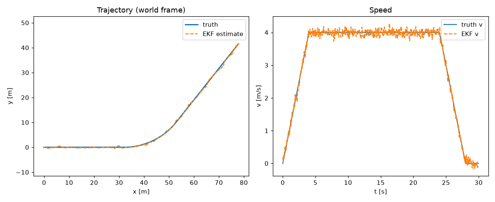

# M0 — Fusing the sensors so the estimate tracks the truth

> **Components:** C1 world-simulator · C2 sensor-models · C3 EKF fusion-estimator. **Established methods (selected + wired, not invented):** 2D kinematics · Gaussian sensor models · Extended Kalman Filter. **Reproduce:** `python scripts/run_demo.py`.

## What we set out to do
Stand up the whole spine end to end before adding any fault detection: a
simulated vehicle, three sensors, and an estimator that fuses them into one guess
of the vehicle's state, and show that the guess tracks the real trajectory.

## What we built
- A simulated vehicle that drives a simple route (accelerate, cruise, curve,
  brake) and gives us the **ground truth** to score against.
- Three sensors, each noisy and partial: **GPS** (position), **IMU**
  (acceleration and turn rate), **wheel speed** (speed).
- An **Extended Kalman Filter** that predicts motion from the IMU and corrects it
  with GPS and wheel speed. See `src/av_integrity/estimation/ekf.py`, which is
  documented for a first-time reader.
- Clean, written **interface contracts** between the parts
  (`docs/REFERENCE_seams.md`), and a small harness that measures accuracy.

## The result
On the clean drive, the fused estimate tracks ground truth closely:
position within about **0.3 m**, heading within **0.03 rad**, speed within
**0.09 m/s**. Run `python scripts/run_demo.py` to reproduce it and see the plot.

## What it deliberately does NOT do yet
Nothing here notices a sensor lying. Every reading is trusted. That is the next
milestone (M1). M0 is about getting the foundation right and honest first: if the
fusion did not track truth cleanly, no fault check on top would mean anything.
