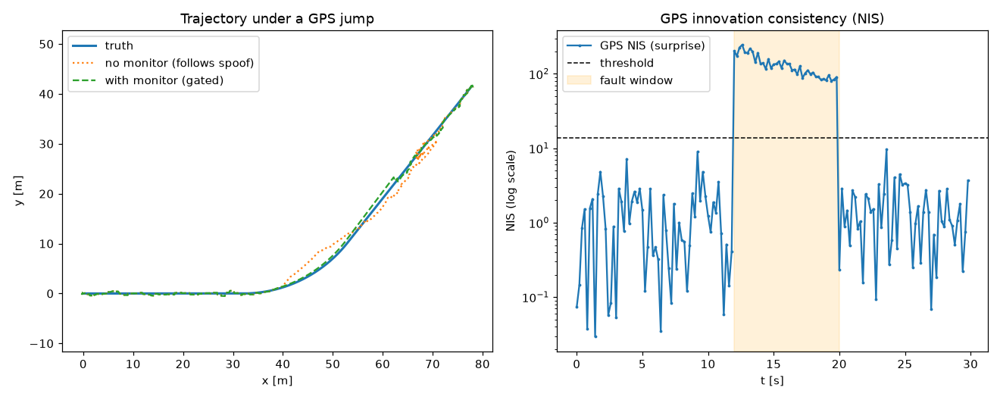

# M1 — Catching a GPS that lies

> **Component:** C4 integrity-monitor (the instant check). **Established method (selected + wired):** normalized-innovation consistency test. **Reproduce:** `python scripts/run_m1.py`.

## The problem
In M0 the filter trusts every reading. So if the GPS suddenly jumps by several
metres and stays there (a real failure: reflections off buildings, or spoofing),
the filter faithfully follows the lie, and the estimate walks off the true path.
The vehicle would act, confidently, on a wrong position.

## The idea, in one line
A reading that is *far more surprising than it should be* is probably not true.

We already compute, for every reading, how far it is from what we expected (the
**innovation**) and how surprising that gap should be by chance (**S**). Combine
them into one score, the **NIS** (see the glossary). Normally it stays small.
When the GPS jumps, it spikes.

## What we built
- An `InnovationMonitor` that computes the NIS for each reading and compares it to
  a statistical threshold set so a healthy sensor almost never trips it.
- **Gating**: when a reading is flagged, the estimator simply does not fold it in.
  A lying sensor is ignored until it behaves again.
- A `gps_jump` scenario to test it against, and a before/after comparison.

See `src/av_integrity/integrity/detector.py`.

## The result
On an 8-metre GPS jump lasting 8 seconds:
- **Detected at the very first bad reading**, with **zero false alarms** the rest
  of the run.
- With the monitor, position error stays at **0.42 m**; without it, the estimate
  follows the spoof and error blows up to **5.59 m**.

Run `python scripts/run_m1.py` to reproduce it. The plot shows the NIS sitting low, then
spiking above the threshold exactly during the fault window.

## Honest limits
This catches a GPS jump specifically. A slow, small drift is harder (it is not
very surprising step to step) and is future work. And while GPS is gated out, the
estimate is dead-reckoning on the IMU and wheels, so it drifts a little; over a
long enough outage that drift matters. Naming these limits is part of the point.
