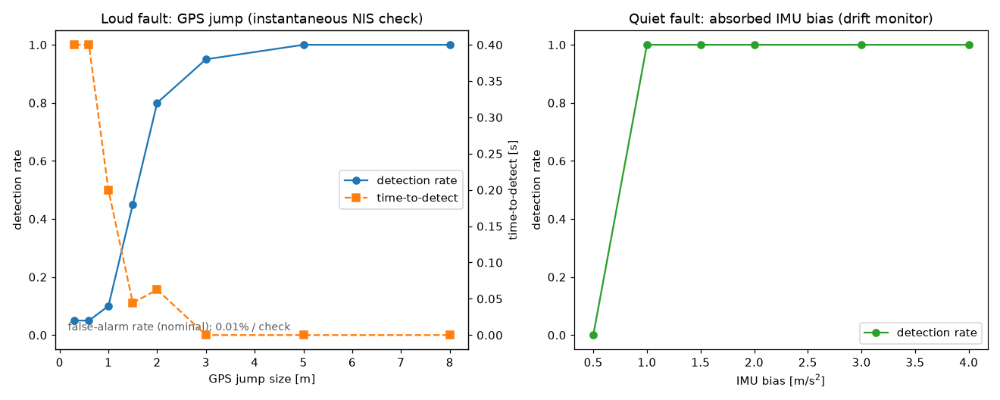

# M4 — Robustness: turning anecdotes into rates

> **Established methods (selected + wired):** Monte-Carlo evaluation + detection / false-alarm / time-to-detect metrics. **Reproduce:** `python -m av_integrity report`.

## Why a single run is not a measurement

M1 through M3 each proved a point on one scenario: "the GPS jump is caught at
onset with zero false alarms", "the drift monitor catches the absorbed bias about
a second in". Those are demonstrations. They answer *can it happen*, not *how
often*. A detector is characterised by three numbers, and none of them survive a
sample size of one:

- **detection rate** — of the drives with a fault, how many did we catch;
- **false-alarm rate** — on a clean drive, how often do we flag anyway;
- **time-to-detect** — once caught, how long after the fault began.

M4 runs the monitors across many seeds and a sweep of fault sizes and reports
those three numbers. Because every fault is injected, ground truth (whether a
fault occurred, and when) is known, so each number is a real measurement, not a
guess. The harness is `src/av_integrity/harness/evaluation.py`.

## What was measured

Two fault families, each against the monitor built for it, plus the clean case:

- **Loud fault — a GPS jump**, swept from 0.3 m to 8 m, judged by the
  instantaneous NIS check (M1/M2).
- **Quiet fault — an absorbed IMU bias**, swept from 0.5 to 4 m/s², judged by the
  drift monitor (M3).
- **Nominal** — 60 clean drives, different seeds, to measure the false-alarm rate.

## The result

**False alarms are rare.** Across 60 nominal drives the instantaneous monitor
raised **3 flags in 54,000 corrector readings — 0.006% per check** (about one stray
flag per 18,000 readings; 3 of the 60 drives had one). That is where a chi-square
99.9% gate should land, and it is the number that keeps the detection rates
honest: a detector that flags everything would "detect" everything too.

**The loud fault has a clean sensitivity curve.** A GPS jump smaller than the GPS
noise (≈0.6 m/axis) is missed — detection sits at the noise floor up to ≈1 m — then
rises sharply: **45% at 1.5 m, 80% at 2 m, 95% at 3 m, and 100% at 5 m and above.**
Once a jump is comfortably detectable it is caught almost instantly: time-to-detect
falls to a single GPS sample (**≈0 to 0.2 s**).

**The quiet fault trades size and speed for reach.** The drift monitor misses a
0.5 m/s² bias entirely but catches everything from **1 m/s² upward at 100%** — a
floor well below the 3 m/s² bias M2 had called "healthy", so it genuinely extends
coverage. The price is latency: it needs a window of evidence, so time-to-detect
runs from **≈4 s at the 1 m/s² floor down to ≈1 s at 4 m/s²**. Slow but sure, by
design.

## Honest limits

- **There is a floor, and it is the sensor noise.** Sub-metre GPS jumps and
  sub-1-m/s² IMU biases are below the noise the estimator already lives with, and
  are not reliably detectable. That is a property of the physics, not a tuning bug.
- **The slow GPS-only drift is still a blind spot.** As flagged in M3, a GPS bias
  that creeps with nothing to contradict it leaves the innovations clean, so
  neither monitor catches it; its detection rate is ≈0 and is reported, not hidden.
- **These are simulation numbers.** They characterise the *method* under injected
  faults with known ground truth. Real GPS/IMU error distributions, timing jitter,
  and tyre dynamics would move the exact thresholds; the shape of the trade-off —
  a noise floor, a fast loud-fault check, a slow sure quiet-fault check — is the
  transferable result.
